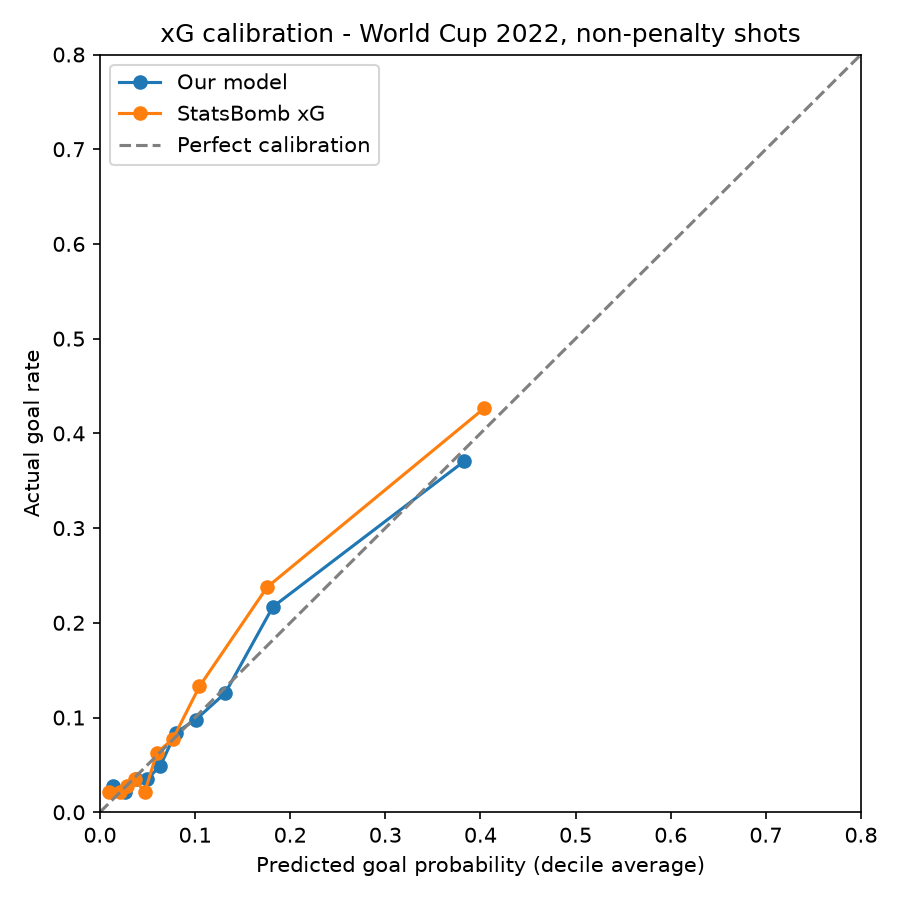

# Soccer Event Data QA & Analytics

Data quality validation and analytics on **StatsBomb open event data** for the **FIFA World Cup 2022**:
64 matches, 234,637 events, built with **Python** and **PostgreSQL**.

**Highlights**

- 8 automated SQL data quality checks; 7 pass, 1 flagged a **real timestamp error in the World Cup final**.
- **PPDA** pressing intensity for all 32 teams, computed in SQL.
- A cross-validated **xG model** (AUC 0.77) benchmarked against StatsBomb xG (AUC 0.82).

## Why

Every advanced metric (xG, possession value, pressing intensity, player ratings) is computed from event data.
A wrong timestamp, a missing goal or a pass credited to the wrong team silently corrupts everything downstream.
This project builds an ingestion pipeline plus a set of SQL checks that act as **regression tests for every new batch of matches**,
and then uses the validated data for analysis.

## Pipeline

    StatsBomb JSON  ->  src/download.py     ->  data/raw/
                    ->  src/ingest.py       ->  PostgreSQL: matches, lineups, events
                    ->  sql/validation.sql  ->  qa.* views + qa.summary
                    ->  sql/analysis.sql    ->  analytics.team_ppda
                    ->  src/xg_model.py     ->  model evaluation + docs/xg_calibration.png

Design choices:

- **Normalized columns + raw `jsonb`.** Key fields (type, player, location, xG, outcomes) are typed columns for fast queries;
  the full original event is kept in `raw`, so nothing is lost and every value can be audited against the source.
- **Idempotent loading.** Each match is loaded in its own transaction (delete + insert), so the pipeline can be re-run safely.
- **Checks return failing rows.** Each `qa.*` view lists only the rows that fail; an empty view means the check passed.

## Quick start

    pip install -r requirements.txt
    python src/download.py                  # default: FIFA World Cup 2022
    createdb soccer
    psql -d soccer -f sql/schema.sql
    python src/ingest.py
    psql -d soccer -f sql/validation.sql
    psql -d soccer -c "SELECT * FROM qa.summary;"
    psql -d soccer -f sql/analysis.sql
    python src/xg_model.py

## 1. Validation checks

| # | Check | Rule | Result |
|---|---|---|---|
| 1 | `goal_mismatch` | Goals in the event stream equal the official score (own goals included, penalty shootout excluded) | ✅ 0 |
| 2 | `events_after_red_card` | A sent-off player has no later on-pitch events | ✅ 0 |
| 3 | `events_outside_sub_window` | No events before a substitute comes on or after a replaced player goes off | ✅ 0 |
| 4 | `bad_pass_recipient` | A pass recipient belongs to the passer's team | ✅ 0 |
| 5 | `location_out_of_bounds` | All coordinates are on the 120 x 80 pitch | ✅ 0 |
| 6 | `broken_related_events` | Every related event exists and belongs to the same match | ✅ 0 |
| 7 | `time_goes_backwards` | Event time never jumps backwards by more than 1 second within a period | ⚠️ 2 |
| 8 | `incomplete_shots` | Every shot has xG, location and outcome | ✅ 0 |

The 1-second tolerance in check 7 is deliberate: sub-second ordering noise between simultaneous events is normal,
and a zero-tolerance rule would bury real problems in false alarms.

### Finding: reset timestamps in the World Cup final

Check 7 flagged two events, both in **Argentina vs France** (match `3869685`):

| Event | Linked pass | Recorded time | Expected time |
|---|---|---|---|
| Ball Receipt, Camavinga (idx 3438) | Tchouaméni, **98:35** (idx 3437) | **45:00** (`00:00:00.275`) | 98:35.9 – 98:37.9 |
| Ball Receipt, Camavinga (idx 3975) | Fofana, **106:02** (idx 3974) | **90:00** (`00:00:00.620`) | 106:02.5 – 106:04.6 |

Investigation:

1. **Not a pipeline bug.** The original `timestamp` in the raw JSON matches the loaded value.
2. **All time fields are affected consistently.** `timestamp`, `minute` and `second` all point to the *start* of the period.
3. **Same pattern twice.** Same event type, same player, both in the last two seconds before the period-ending whistle.
   This looks systematic (an event recorded at the whistle receiving a default time of zero) rather than random noise.
4. **Correct position confirmed.** Both receipts are linked via `related_events` to the pass immediately before them,
   so the true time is bounded by that pass and the `Half End` event.

Handling: **flag, don't silently fix.** Keep the original value, add a corrected timestamp bounded by the
neighbouring events, and record the reason. Next step would be to scan other competitions for the same
pattern and, if it recurs, report it to the provider.

## 2. Pressing intensity (PPDA)

**PPDA** = opponent open-play passes in their own 60% of the pitch / our defensive actions (tackles, interceptions,
fouls, challenges) in that zone. **Lower = more intense pressing.** StatsBomb coordinates are oriented per acting team,
so the zones are `x < 72` for opponent passes and `x > 48` for our defensive actions. Set pieces and the penalty shootout are excluded.

| Most intense | PPDA | | Least intense | PPDA |
|---|---|---|---|---|
| Mexico | 8.38 | | Costa Rica | 28.26 |
| Spain | 9.08 | | Qatar | 22.53 |
| England | 10.43 | | Senegal | 20.42 |
| Germany | 10.57 | | Japan | 18.22 |
| Ecuador | 11.14 | | Australia | 17.86 |

Semi-finalists: Argentina 12.33 (13th of 32), Croatia 13.03 (14th), France 15.43 (22nd), **Morocco 17.24 (25th)**.

Takeaways:

- **PPDA measures style, not quality.** Morocco reached the semi-final with one of the most passive PPDAs,
  defending in a compact low block.
- **PPDA depends on the opponent.** Japan and Costa Rica faced Spain and Germany, the two biggest possession teams,
  which inflates their numbers. Japan also switched from a low block to a high press between halves,
  which a tournament-level number hides. A fairer comparison would adjust per match for what each opponent usually allows.

## 3. Expected goals (xG) model

Logistic regression on **1,430 non-penalty shots** (152 goals) with seven features: distance, angle between the posts,
header, direct free kick, first-time shot, under pressure and counter-attack. Predictions are **out-of-fold (5-fold CV)**,
so every shot is scored by a model that never saw it.

| Model | Log loss ↓ | Brier ↓ | AUC ↑ | Total xG |
|---|---|---|---|---|
| This model | 0.2935 | 0.0835 | 0.772 | 152.7 |
| StatsBomb xG | **0.2665** | **0.0762** | **0.815** | 137.9 |

Takeaways:

- **StatsBomb is better, as expected.** Their model uses freeze-frame data (goalkeeper and defender positions);
  the gap shows how much value that context adds over event data alone.
- **The tournament beat its xG.** 152 non-penalty goals from 137.9 StatsBomb xG, about 14 more than expected.
  Possible reasons: a model trained mostly on club football, or an above-average finishing tournament.
- **Coefficients make football sense.** Distance is by far the strongest factor, headers convert less often,
  and a wider angle increases goal probability. Distance and angle are correlated, so they share the effect.
- **Finishing needs volume.** Mbappé scored 6 non-penalty goals from 2.67 xG on 29 shots (+3.3). Gakpo's +2.4
  came from just 5 shots, which is mostly noise. Goals minus xG should always be shown with the shot count.

## Project structure

    src/download.py      download one competition/season from StatsBomb open data
    src/ingest.py        load raw JSON into PostgreSQL
    src/xg_model.py      xG model, evaluation and calibration plot
    sql/schema.sql       tables and indexes
    sql/validation.sql   data quality checks (qa schema)
    sql/analysis.sql     team analytics (analytics schema)
    docs/                charts used in this README

## Data source

Data provided by [StatsBomb](https://github.com/hudl/open-data) (Hudl) open data, used under their terms for research purposes.
